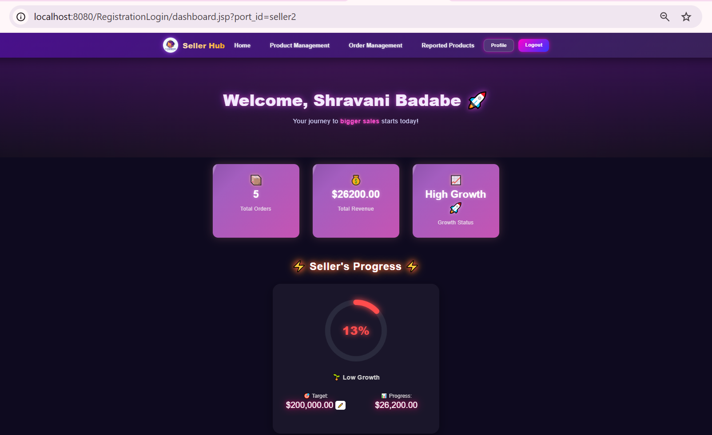
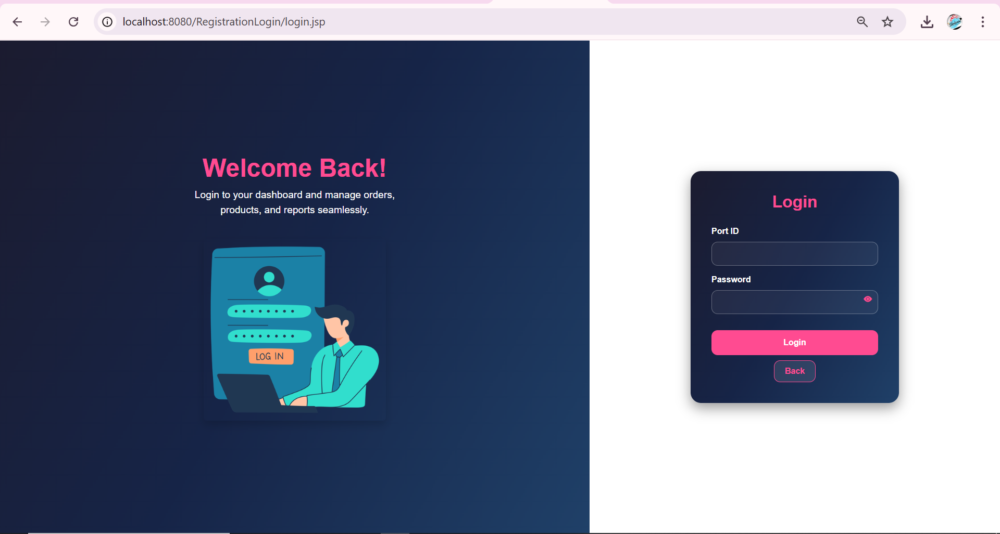
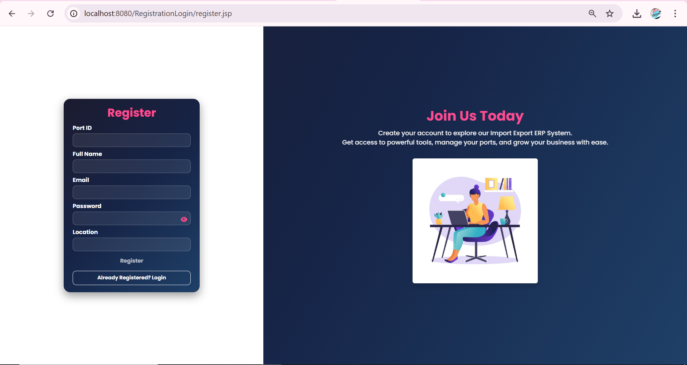
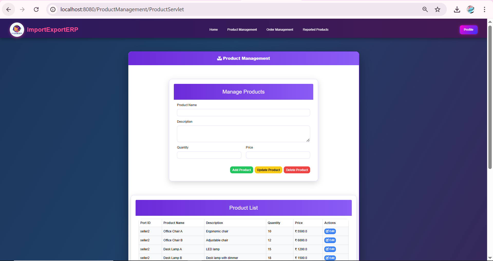
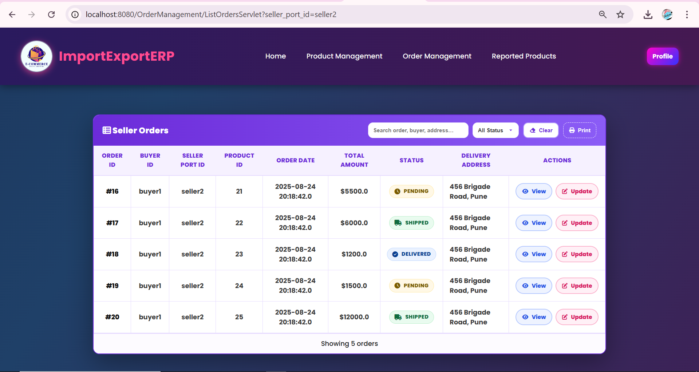
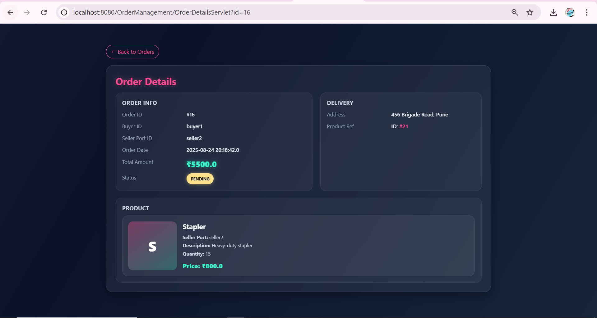
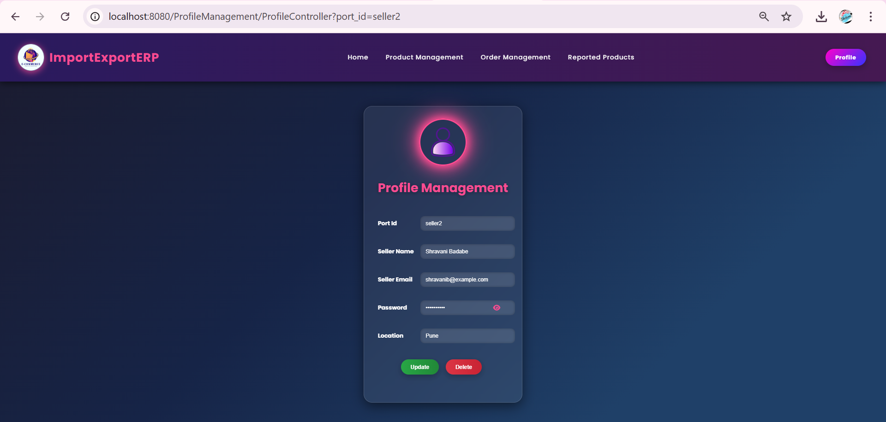
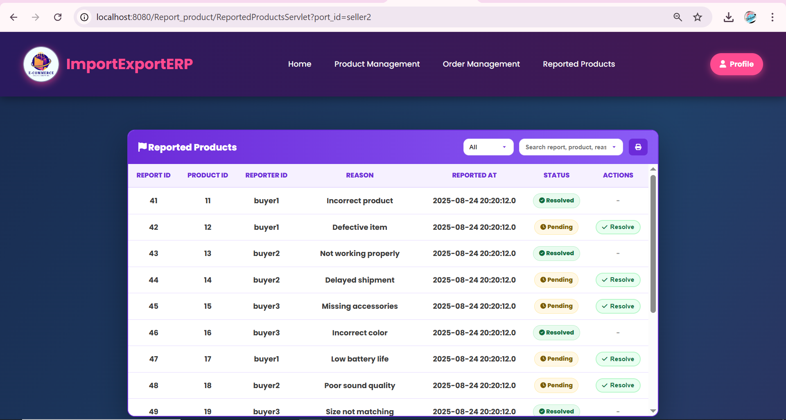

# 🚢 Import Export ERP System

A web-based Enterprise Resource Planning (ERP) system developed for import-export sellers to manage products, orders, reported products, and user profiles. The application follows the MVC2 architecture using JSP, Servlets, JDBC, and MySQL, providing a structured and scalable solution for business management.

## 📌 Project Overview

The Import Export ERP System was developed as part of my internship at SDAC Infotech. The system helps sellers efficiently manage inventory, orders, and business operations through a centralized dashboard. It also includes AI/ML-based modules and chatbot support for enhanced decision-making and user assistance.

## ✨ Features

### User Authentication

* Seller Registration
* Secure Login System
* Session Management
* Profile Update and Delete

### Product Management

* Add New Products
* Update Product Information
* Delete Products
* View Product Listings

### Order Management

* View Seller Orders
* Update Order Status
* Track Pending, Shipped, Delivered, and Cancelled Orders

### Reported Product Management

* View Reported Products
* Handle Product Reports
* Resolve Reported Issues

### AI & ML Features

* AI-based business insights
* Demand forecasting using Machine Learning
* Inventory planning suggestions
* Data analytics dashboard

### Chatbot Support

* Rule-based chatbot assistance
* Quick responses for common seller queries
* Dashboard guidance and support

## 🛠️ Tech Stack

### Frontend

* HTML5
* CSS3
* Bootstrap 5
* JSP

### Backend

* Java
* Servlets
* JDBC

### Database

* MySQL

### Architecture

* MVC2 (Model View Controller)

### Tools

* Eclipse IDE
* Apache Tomcat
* Git & GitHub

## 🗄️ Database Design

The system consists of the following major tables:

* Users
* Products
* Orders
* Reported Products
* ML Data

Relationships are implemented using Primary Keys and Foreign Keys to maintain data integrity.

## 📂 Project Modules

### Seller Module

* Registration
* Login
* Product Management
* Order Management
* Profile Management

### Product Module

* Add Product
* Update Product
* Delete Product
* View Products

### Order Module

* View Orders
* Update Order Status

### Report Module

* View Reports
* Resolve Reports

### AI/ML Module

* Business Insights
* Demand Forecasting
* Inventory Optimization

### Chatbot Module

* Seller Assistance
* Query Handling

## 📸 Screenshots

Add screenshots of:

1. Registration Page
2. Login Page
3. Seller Dashboard
4. Product Management
5. Order Management
6. Reported Products
7. AI Insights Dashboard
8. Chatbot Interface

## 🚀 Installation & Setup

### Clone Repository

```bash
git clone https://github.com/yourusername/import-export-erp-system.git
```

### Import Project

1. Open Eclipse IDE
2. Import Existing Dynamic Web Project
3. Configure Apache Tomcat Server
4. Import MySQL Database

### Database Configuration

Update database credentials in the JDBC connection file:

```java
String url = "jdbc:mysql://localhost:3306/import_export_db";
String username = "root";
String password = "your_password";
```

### Run Application

1. Start Apache Tomcat
2. Deploy the project
3. Open browser

```text
http://localhost:8080/ImportExportERP
```
## 📸 Screenshots

### Dashboard



### Login Page



### Registration Page



### Product Management



### Order Management



### Order Details



### Profile Management



### Reported Products



## 🎯 Learning Outcomes

* MVC2 Architecture Implementation
* Java Servlet Development
* JSP Integration
* JDBC Database Connectivity
* MySQL Database Design
* Session Management
* CRUD Operations
* Software Requirement Analysis (SRS)
* ERP System Development
* AI/ML Feature Integration

## 👩‍💻 Author

**Shravani Rajaram Badabe**

* LinkedIn: https://linkedin.com/in/shravani-badabe
* GitHub: https://github.com/Shravanibadabe
* Portfolio: https://shravanibadabe.netlify.app
